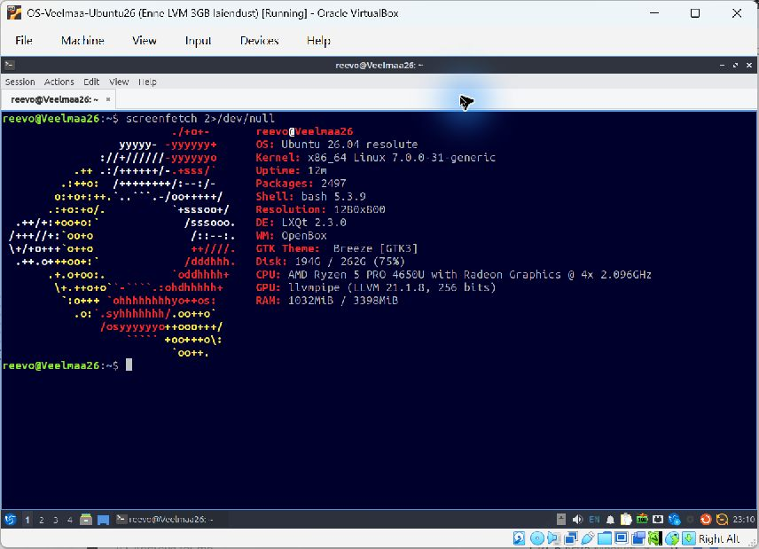
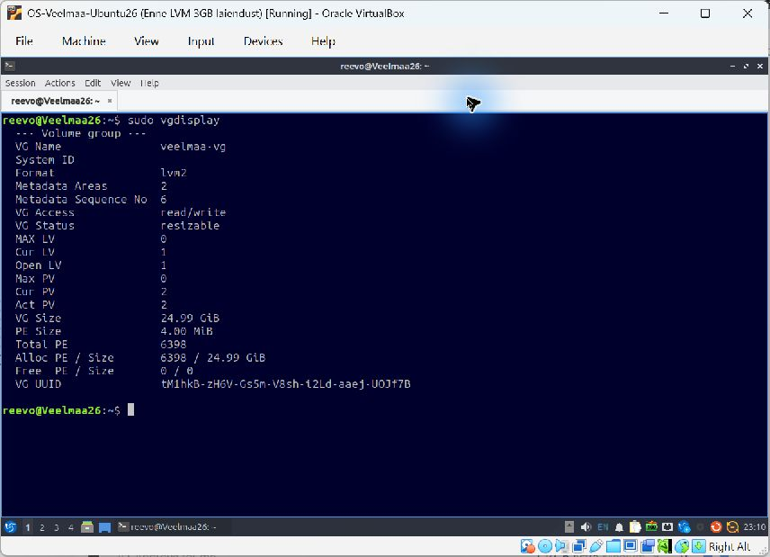
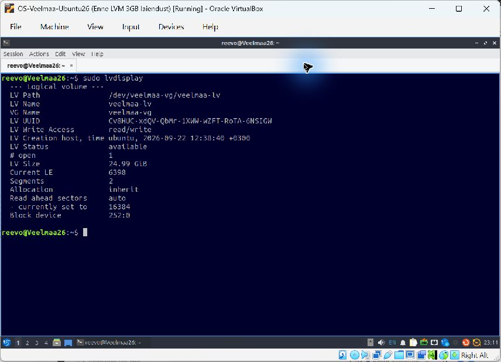
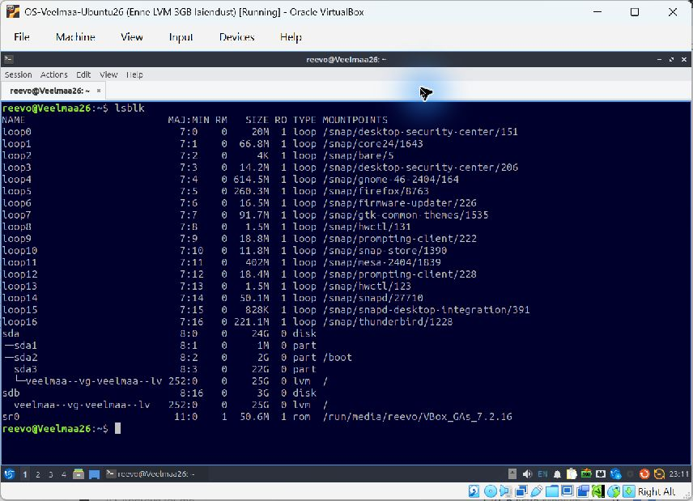
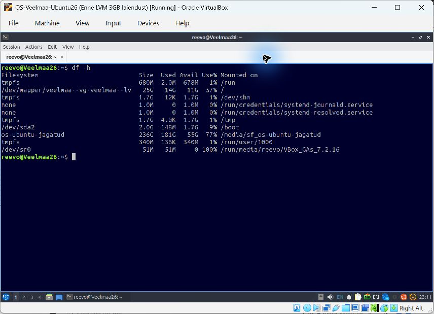

# Praktikum 3 – Ubuntu paigaldus ja LVM-i seadistamine

**Nimi:** Reevo Veelmaa  
**Virtuaalmasin:** OS-Veelmaa-Ubuntu26  
**Kasutaja ja arvuti:** `reevo@Veelmaa26`  
**Kontrollitud:** 05.10.2026

Juhend: [Tartu Ülikooli operatsioonisüsteemide 3. praktikum](https://courses.cs.ut.ee/2026/os/fall/Main/Praktikum3).

## Ubuntu ja Lubuntu

Virtuaalmasinas töötab Ubuntu 26.04 (resolute), kernel `7.0.0-31-generic`. Lubuntu töölauakeskkond on LXQt 2.3.0 ja aknahaldur OpenBox. Virtuaalmasinale on määratud 4 protsessorituuma, 4096 MB muutmälu ja 128 MB videomälu. VirtualBox Guest Additions 7.2.16 on olemas, lõikelaud on kahesuunaline ning jagatud kaust `os-ubuntu-jagatud` on ühendatud. GNOME'i sisestusallikates on nii USA kui ka Eesti klaviatuuripaigutus.

Kuvatud käsk `screenfetch 2>/dev/null` näitab süsteemi andmeid; veavoo suunamine peidab screenfetchi käivitamisel tekkinud Qt teavitused.



## LVM-i laiendamine

Enne laiendamist olid volüümigrupp `veelmaa-vg` ja loogiline volüüm `veelmaa-lv` juba ümber nimetatud ning süsteem käivitus nendega. Algne 24 GB virtuaalketas sisaldas ligikaudu 22 GiB LVM-i füüsilist volüümi `/dev/sda3` ja eraldi `/boot` partitsiooni.

Lisatud on dünaamiline 3 GB VDI-ketas `praktikum3.vdi`, mis ühendati teise SATA porti ja ilmus Linuxis seadmena `/dev/sdb`. Enne muudatusi loodi VirtualBoxi taastamispunkt `Enne LVM 3GB laiendust`. Ketta tühjust kontrolliti käskudega `lsblk` ja `sudo wipefs -n /dev/sdb`.

Laiendamiseks käivitati järjest:

```bash
sudo pvcreate /dev/sdb
sudo vgextend veelmaa-vg /dev/sdb
sudo lvextend -l +100%FREE /dev/veelmaa-vg/veelmaa-lv
sudo resize2fs /dev/veelmaa-vg/veelmaa-lv
```

Käsud õnnestusid. Loogiline volüüm kasvas 5631 ulatuselt 6398 ulatuseni ning ext4 failisüsteem laiendati töötava süsteemi sees 6 551 552 neljakibibaidise plokini.

## Kontrolltulemused

| Kontroll | Tulemus |
| --- | --- |
| Volüümigrupp | `veelmaa-vg` |
| Füüsilised volüümid | `/dev/sda3` ja `/dev/sdb`, kokku 2 |
| Volüümigrupi suurus | 24,99 GiB |
| Jaotamata ala grupis | 0 ulatust / 0 baiti |
| Loogiline volüüm | `/dev/veelmaa-vg/veelmaa-lv` |
| Loogilise volüümi suurus | 24,99 GiB |
| Juurfailisüsteem | ext4, ühenduspunkt `/` |
| `df -h` tulemus juurfailisüsteemile | 25G kokku, 14G kasutatud, 11G saadaval |

### Volüümigrupp: `sudo vgdisplay`



### Loogiline volüüm: `sudo lvdisplay`



### Kettad: `lsblk`

Mõlemad füüsilised kettad on seotud sama 25G loogilise volüümiga.



### Failisüsteemid: `df -h`



## Esitamine

See kaust sisaldab aruannet ja kõiki viit nõutud kuvatõmmist.

Aruande link: https://github.com/Reevo-Veelmaa/learngit/tree/main/praktikum3

Aruande lingi esitab üliõpilane ise [Moodle'i ülesandesse](https://moodle.ut.ee/mod/assign/view.php?id=1195119).
