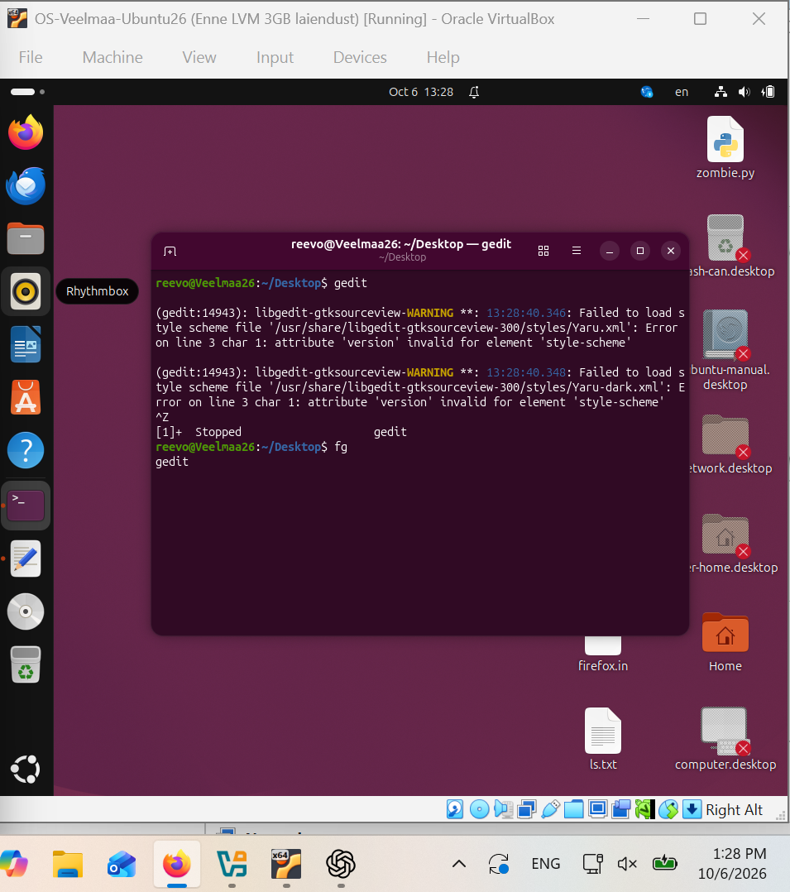
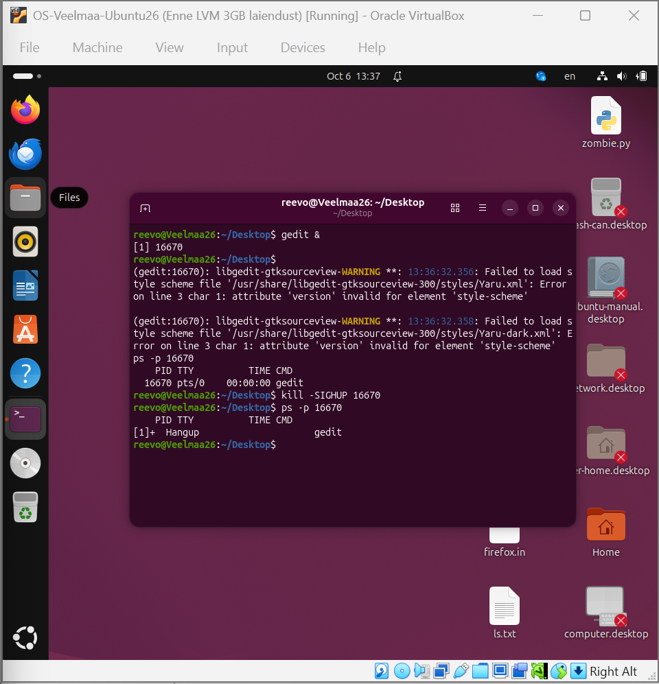
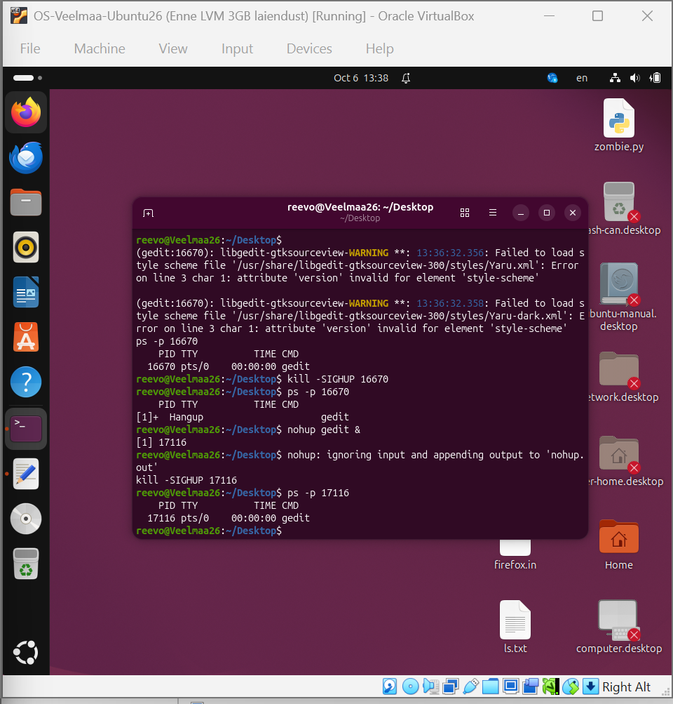
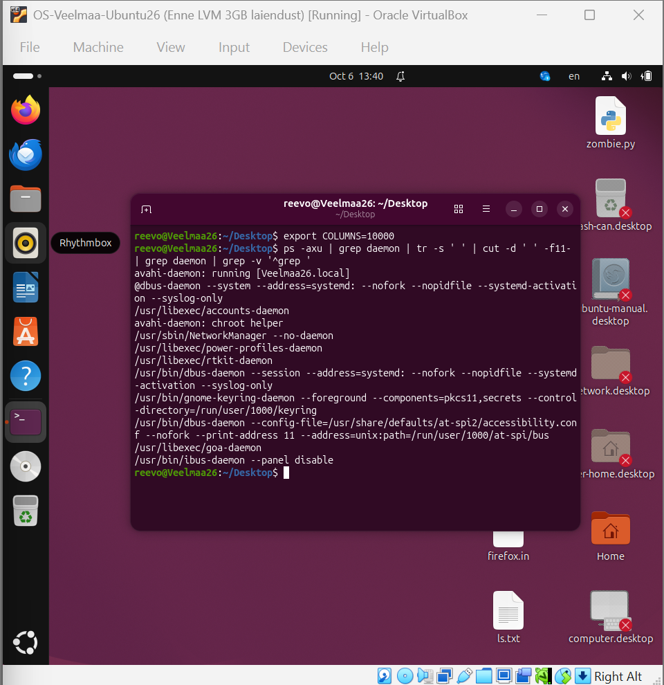
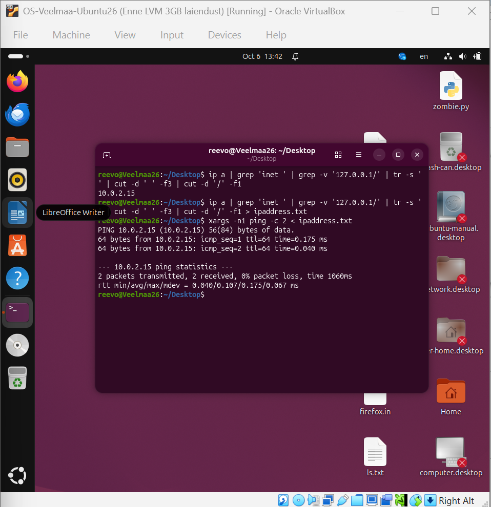

# Praktikum 5

Reevo Veelmaa

## Ülesanne 5-1 – Protsessi peatamine ja jätkamine

Käivitasin terminalis `gedit`i. `Ctrl+Z` peatas protsessi (`Stopped`, signaal `SIGTSTP`). Käsk `fg` jätkas peatatud programmi tööd esiplaanil, saates sellele `SIGCONT`-signaali.



Allikas: [POSIX – tööde juhtimine](https://pubs.opengroup.org/onlinepubs/9799919799/utilities/V3_chap02.html).

## Ülesanne 5-2 – SIGHUP ja nohup

Käivitasin `gedit &` käsuga protsessi 16670. Pärast `kill -SIGHUP 16670` protsess lõppes ja `ps -p 16670` näitas ainult päist.



Käsuga `nohup gedit &` käivitatud protsess 17116 jäi pärast `kill -SIGHUP 17116` alles. Seda näitab `ps -p 17116` väljund.



## Ülesanne 5-3 – ps-i väljundi töötlemine

```bash
export COLUMNS=10000
ps -axu | grep daemon | tr -s ' ' | cut -d ' ' -f11- | grep daemon | grep -v '^grep '
```

`tr` surub järjestikused tühikud kokku ja `cut` jätab alles programminimed koos parameetritega. Alles jäävad ainult `daemon`-it sisaldavad käsuread, otsimise `grep`-protsessid eemaldatakse. `COLUMNS=10000` annab pikkade käsuridade jaoks piisava väljundilaiuse.



## Ülesanne 5-4 – IP-aadressi eraldamine

```bash
ip a | grep 'inet ' | grep -v '127.0.0.1/' | tr -s ' ' | cut -d ' ' -f3 | cut -d '/' -f1
ip a | grep 'inet ' | grep -v '127.0.0.1/' | tr -s ' ' | cut -d ' ' -f3 | cut -d '/' -f1 > ipaddress.txt
xargs -n1 ping -c 2 < ipaddress.txt
```

Käsk eraldab IPv4-aadressi, jättes välja loopback-aadressi. Väljade järgi lõikamine sobib eri pikkusega aadressidele. Tulemuseks sain `10.0.2.15`, mis salvestati faili `ipaddress.txt`. Ping saatis 2 paketti ja sai 2 vastust, paketikaotus oli 0%.



## Ülesanne 5-5 – Windowsi sõnumid

Logifail: [teatedOut.txt](teatedOut.txt). Logis on näha hiireklikke, akna maksimeerimine, suuruse taastamine ja sulgemine.

### 1. WM_SIZE – ID 5 (0x0005)

```text
13:20:56.184,5,"WM_SIZE",2,63833984
```

Sõnum saadetakse akna suuruse muutumisel. Selles näites maksimeeriti aken.

- `wParam = 2` tähendab `SIZE_MAXIMIZED` ehk aken maksimeeriti.
- `lParam = 63833984` sisaldab kliendiala mõõtmeid: alumised 16 bitti annavad laiuse **1920**, ülemised 16 bitti kõrguse **974** pikslit. See on akna sisuosa, mitte koos raami ja tiitliribaga.
- Arvutus: `63833984 = 974 × 65536 + 1920`.

Allikas: [Microsoft – WM_SIZE](https://learn.microsoft.com/en-us/windows/win32/winmsg/wm-size).

### 2. WM_LBUTTONDOWN – ID 513 (0x0201)

```text
13:20:54.717,513,"???",1,24510932
```

See sõnum tekkis hiire vasaku nupu vajutamisel akna kliendialas.

- `wParam = 1` tähendab `MK_LBUTTON`: vasak hiirenupp on all.
- `lParam = 24510932` sisaldab kursori koordinaate **x = 468, y = 374**, arvestatuna kliendiala ülemisest vasakust nurgast. x on alumises ja y ülemises 16-bitises osas.
- Arvutus: `24510932 = 374 × 65536 + 468`.

Allikas: [Microsoft – WM_LBUTTONDOWN](https://learn.microsoft.com/en-us/windows/win32/inputdev/wm-lbuttondown).

### Tõlketabelist puuduvad sõnumid

Logis leidusid `???` nimega **513 (WM_LBUTTONDOWN)** ja **514 (WM_LBUTTONUP)**. Mõlemad ID-d on väiksemad kui 45000. Need tekkisid hiire vasaku nupu vajutamisel ja vabastamisel.

```text
13:20:54.780,514,"???",0,24510932
```

Vabastamisel on `wParam = 0`: ükski selle sõnumi loetletud hiirenupp ega Shift/Ctrl pole all. `lParam` näitab sama kohta **(468, 374)** nagu vajutamisel. Seega on logis olemas ühe klõpsu vajutus ja vabastus.

Allikas: [Microsoft – WM_LBUTTONUP](https://learn.microsoft.com/en-us/windows/win32/inputdev/wm-lbuttonup).
